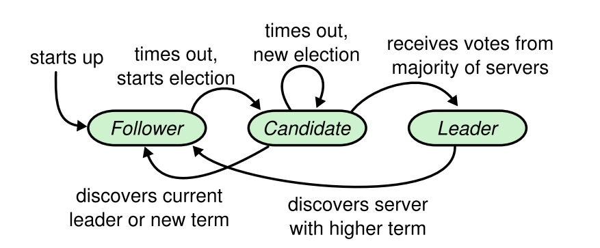
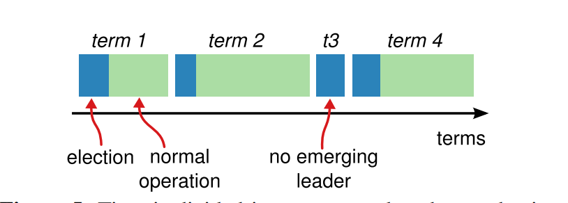
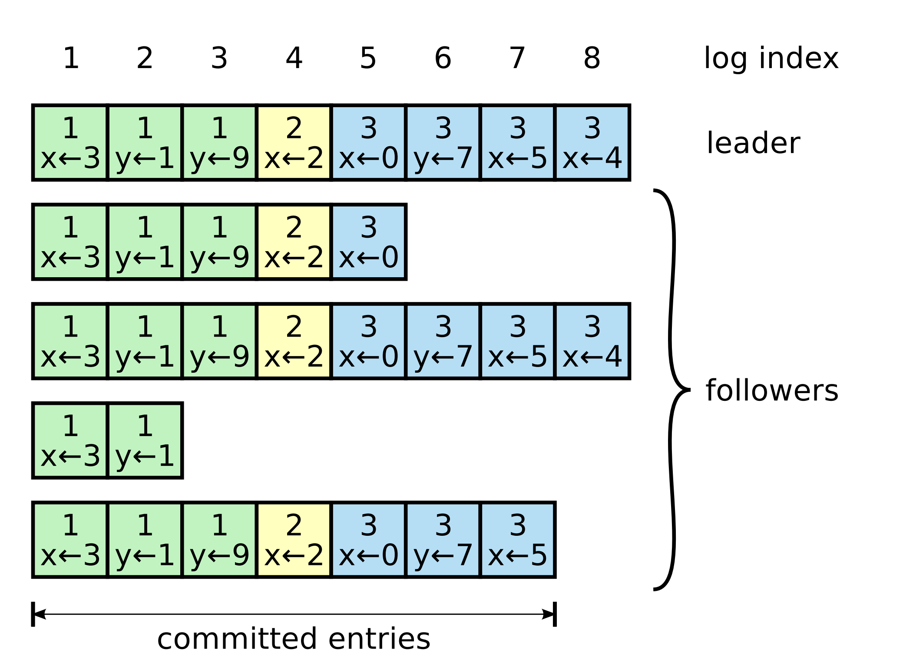

## Raft节点类型
Raft将所有节点分为三个身份：
* Leader： 集群中最多有且仅有一个leader，负责发起heartbeat， 响应客户端请求，创建日志与同步日志。
* Candidate：Leader选举过程中的临时角色，有follower转变，发起投票并参与竞选。
* Follower：接受并持久化来自Leader的heartbeat和日志同步数据，投票给candidate。

下图是三种状态的状态转移图
1. 开始时所有的节点都处于Follower状态，在一段时间内没有收到来自Leader的心跳包是，将会切换到candidate的状态。
2. 当出现time out（比如心跳包丢失等情况），发起新一轮选举，如果获得来自大多数server的投票，则成为leader，如果别的server成为Leader，则返回Follower状态。

## Raft RPC 类型
Server 之间通过RPC（Remote Procedure Call）的形式进行通信，Raft里常用的RPC有三种：
* RequestVote RPC
  在选举期间由candidate节点发起。
* AppendEntries RPC
  在任期内由leader发起，将日志的entry发送给follower用于同步，同时也用于leader向follower发送心跳包用于保证leader的有效性。
* SnapShot RPC
  在传输节点的snapshot时使用

[Zhihu](https://zhuanlan.zhihu.com/p/314927071)
[Blog](https://tanxinyu.work/raft/)

## 任期选举

Raft将时间划分为任意不同长度的term。每一个term都是一次选举，一个或多个candidate会试图成为leader。如果一个leader赢得选举，他就会在这个term担任leader。在某些情况下，选票会被均分，也就是`splite vote`(比如总节点数为偶数时，两个candidate获得相同选票)，此时无法选择出该term的leader，那么在该term的选举超时后开启另外一个term的选举。

不同服务器节点可能多次观察到term之间的转化，但在某些情况下，一个节点也可能观察不到任何一次选举或整个term全程。term在raft算法中充当逻辑时钟的作用。这会允许服务器节点查明一些过期的信息（比如过期的leader）。

每个节点会储存当前term的id，这一id会在整个事件内单调递增。当服务器之间通信的时候会交换term id。比如当发现自己的id低于别的id时，他会更新自己的id到更新的值。或者一个candidate/leader发现自己的term过期了，他会立即返回follower。如果一个节点接收到一个包含过期term id的请求，那么这次请求会被丢弃或者忽略。这个过程类似于`Lamport timestamp`.

## 安全性
Raft保证在这些属性总是真的：
* Election Safety：每个term最多只有一个leader；集群在同一时间内只有一个可以读写的leader。
* Leader Append-Only：leader的日志是只增的。
* Log Matching：如果两个节点日志中有两个entry有相同的idx与term，那么他就是相同的entry。
* Leader Completeness：一旦一个操作被提交了，那么在之后的term中，那么该操作都会存在于日志。
* State Machine Sataty：一致性，一旦一个节点应用了某个idx的entry到状态机，那么其他所有节点应用该idx的操作都是一致的。

## 领导人选举
raft使用心跳来维持leader的身份，任何节点都以follower的身份初始化。leader会定期的发送心跳给所有follower以确保自己的身份，每当follower收到心跳后，就刷新自己的electionElapsed，开始重新计时。
（electionElapsed被成为选举耗时，electionTimeout是指预设的选举超时）

一旦一个folloer在指定的时间内没有疏导任何RPC（即electionTimeout）时，会立即发起一次选举。当follower试图发起选举后，自己会成为candidate，在增加自己的term后，会向所有节点发起RequestVoteRPC请求，candidate的状态会一直持续到：
* 赢得选举
* 其他节点赢得选举
* 一轮选举结束，无人胜出

选举方式非常简单，当一个节点或者多数选票`N/2 + 1`，那么这个节点就会成为新的leader。在一个candidate节点等待投票时，他可能会说到来自其他节点声明自己时leader的心跳。此时有两种情况：
* 该请求的term和自己一样或更大：说明对方已经成为leader，自己立刻退回follower。
* 请求的term小于自己：拒绝请求并返回当前term让请求节点更新自己的term。

为了防止在同一个时间有太多follower转变为candidate导致无法选出绝对多数，raft采用随机选举超时机制，每一个candidate在发起选举后，都会随机一个新的选举超时时间，一旦超时还没有完成选举时，会增加自己的term，然后发起下一轮选举。在这种情形下，可以在较短时间内选出leader。（因为term较大的更大概率压倒其他节点）

## 日志同步
leader被选举后，则负责所有的客户端请求，每一个客户请求都包含一个命令，该命令可以被作用到RSM。

leader收到客户端请求后，会生成一个entry，包含`<index, term, cmd>`, 再将这个entry添加到自己的日志末尾，向所有的节点广播该entry。

follower如果同意接受该entry，则在将entry添加自己的日志后，返回同意。

如果leader收到了大多数的成功返回，则将该entry应用到自己的RSM，之后可以称该entry时committed。该committed信息会随着随后的appendetries或heart beat RPC被传输到其他节点。

Raft总能保证一下两个性质：
* 如果在不同节点的日志中，有两个entry拥有相同的index和term，那么它一定拥有相同的cmd；
* 如果在不同节点的日志中，有两个entry拥有相同的index和term，那么它们的前一个entry也一定相同。

通过`Election Safety`来保证第一个性质，通过一致性检查`consistency check`来保证第二个性质。其中`consistency check`是指当leader与follower进行`AppendEntriesRPC`通信时，会连带着上一条entry的信息（包含index与term id）。如果在该节点的日志中没有找到上一条entry的信息，那么follower拒绝这个请求。一旦leader发现这个follower拒绝了请求，那么则会与这个follower再进行一轮一致性检查，找到双方的最长公共序列，然后用leader的entries覆盖这个follower在这个序列之后的所有数据。

在寻找这个序列时，leader还是通过`AppendEntriesRPC`与follower通信，方法是再发上上一块的entry，直到找到公共点为止。当然，如果通过二分算法理论上可以使得算法效率得到提升。

每个leader都会为每一个follower保存一个nextidx变量，用来标记需要发送给这个follower的entry的index。当leader刚刚当选时，该值会初始化为该leader的log的entry index + 1。 一旦follower拒绝了这个entry，那么leader会执行index-1.直到follower接受这个entry后，将matchindex设置为此时的nextindex - 1. 然后开始复制。 

## 安全性
### 选举限制
因为leader的强势地位，所以raft在投票阶段就会确保选出的leader一定会包含整个cluster中目前已经commited的所有日志。

当candidate发送RequestvoteRPC时，会带上最后一个entry的信息。所有的节点收到该请求后，都会对比自己的日志，如果发现自己的日志更新一些的时候则会拒绝给该candidate投票。（pre-vote 同理，也就是candidate的选举）

对比时首先对比term，其次对比entry index。

## 相关资料 ##
[Raft 会议论文](https://raft.github.io/raft.pdf)
[Raft 博士论文](https://web.stanford.edu/~ouster/cgi-bin/papers/OngaroPhD.pdf)